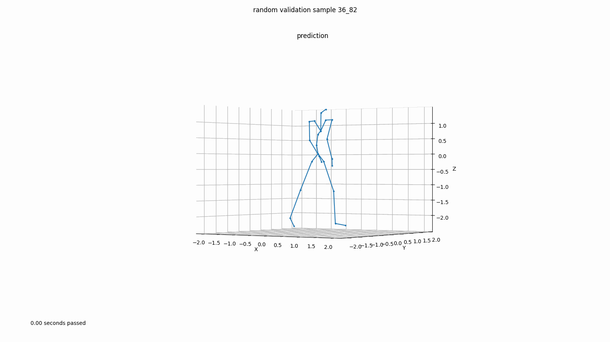

# Moir4e
## 2022 Machine Perception project 2 - Human Motion Prediction - code solution

Predicting future motion of human body model using frame sequences:


You can find a detiled description of the architecture in the [project report](Moir4e/Machine_Perception_Report_Moi4e.pdf). 

 #### :tada: The **dct_att_gcn** model **scored 1st on the public leaderboard** achieving state of the art performance :tada:

- To train dct att gcn model on cluster: 
``` 
$ bsub -n 6 -W 4:00 -o model_dct_att_gcn -R "rusage[mem=1024, ngpus_excl_p=1]" python train.py 
```

- To instead train the original lstm try run:
``` 
python train.py --model seq2seq_lstm --n_epochs 1000 --lr 0.0005 --use_lr_decay --lr_decay_step 330 --bs_train 128 --bs_eval 128 --nr_dct_dim 64 --lr_decay_rate 0.98 --opt adam --kernel_size 40 --clip_gradient --max_norm 1
 ```

## Project Desctiption:
Predicting how human motion evolves in the short-term future is a task that has many applications in human-computer interaction, computer vision, or robotics and is an important building block in systems used for autonomous navigation (e.g. self-driving cars).

Human motion data can come in many forms. In this project, we are working with skeletal representations, i.e. we represent the human body as a set of its major joints which is organized in a tree-like, hierarchical chain that defines how the joints are linked together. Each joint is parameterized as a rotation that defines how one bone segment must be rotated to obtain the orientation of the following bone segment.

## Task:
Given sequences of pre-recorded human motion data and *predict how the motion continues for several frames in the future*.

## Disclaimer:
The skeleton code is copyright-protected: "Copyright ETH Zurich, Manuel Kaufmann"
